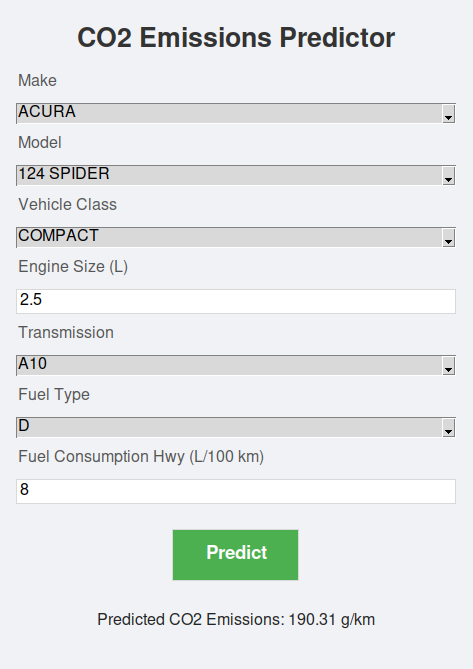

# CO2 Emissions Prediction System

## Overview
The CO2 Emissions Prediction System is a machine learning-based application designed to predict the CO2 emissions (in grams per kilometer) of vehicles based on various features such as vehicle make, model, class, engine size, transmission, fuel type, and highway fuel consumption. The system leverages three machine learning models—Linear Regression, Random Forest, and Support Vector Regressor (SVR)—to provide accurate predictions. It consists of a FastAPI backend for model inference and a Tkinter-based GUI for user interaction.

This project demonstrates a practical application of machine learning in environmental data analysis, enabling users to estimate vehicle emissions and make informed decisions for sustainability.

---

## Features
- **Dataset-Driven Predictions**: Utilizes a processed dataset (`df_new_encoded`) derived from `CO2_Emissions_Canada.csv` to train and predict CO2 emissions.
- **Multiple Models**: Employs three machine learning models (Linear Regression, Random Forest, SVR) to provide diverse prediction perspectives.
- **FastAPI Backend**: A robust API backend for handling prediction requests and scaling input data.
- **Tkinter GUI**: A user-friendly interface for inputting vehicle features and displaying predicted CO2 emissions.
- **Error Handling**: Includes comprehensive error handling for invalid inputs and API communication issues.
- **Scalable Design**: Built with scalability in mind for potential production deployment.

---

## Dataset
The system uses a processed dataset (`df_new_encoded`) derived from the `CO2_Emissions_Canada.csv` file. Below are the details of the dataset and its features:

### Features in `df_new_encoded`
The dataset contains the following encoded and scaled features:

- **Make (encoded)**  
  - Original Type: Categorical (string)  
  - Description: The manufacturer of the vehicle (e.g., Toyota, Ford).  
  - Encoding: Label-encoded to integers (e.g., Toyota = 1, Ford = 2).  
  - Role: Captures brand-specific effects on emissions.

- **Model (encoded)**  
  - Original Type: Categorical (string)  
  - Description: The specific model of the vehicle (e.g., Camry, F-150).  
  - Encoding: Label-encoded to integers.  
  - Role: Reflects model-specific characteristics affecting CO2 emissions.

- **Vehicle Class (encoded)**  
  - Original Type: Categorical (string)  
  - Description: The class of the vehicle (e.g., Compact, SUV).  
  - Encoding: Label-encoded to integers.  
  - Role: Indicates vehicle type, influencing fuel efficiency and emissions.

- **Engine Size (L)**  
  - Original Type: Numerical (float)  
  - Description: The engine displacement in liters.  
  - Encoding: Scaled using `StandardScaler` (no encoding as it’s numerical).  
  - Role: Larger engines typically produce higher emissions.

- **Transmission (encoded)**  
  - Original Type: Categorical (string)  
  - Description: The type of transmission (e.g., Automatic, Manual).  
  - Encoding: Label-encoded to integers.  
  - Role: Affects fuel consumption and emissions.

- **Fuel Type (encoded)**  
  - Original Type: Categorical (string)  
  - Description: The type of fuel used (e.g., Gasoline, Diesel).  
  - Encoding: Label-encoded to integers.  
  - Role: Fuel type significantly impacts CO2 emissions.

- **Fuel Consumption Hwy (L/100 km)**  
  - Original Type: Numerical (float)  
  - Description: Fuel consumption on highways in liters per 100 kilometers.  
  - Encoding: Scaled using `StandardScaler` (no encoding as it’s numerical).  
  - Role: Higher fuel consumption correlates with higher emissions.

### Target Variable
- **CO2 Emissions (g/km)**  
  - Type: Numerical (float)  
  - Description: The CO2 emissions of the vehicle in grams per kilometer.  
  - Role: The target variable predicted by the machine learning models.

---

## System Architecture

### 1. FastAPI Backend (`app.py`)
The backend serves as the prediction engine and handles the following tasks:
- **Input Processing**: Receives input data via a POST request to the `/predict` endpoint. The input must match the `df_new_encoded` columns (Make, Model, Vehicle Class, Engine Size, Transmission, Fuel Type, Fuel Consumption Hwy).
- **Data Validation**: Uses a Pydantic model (`InputData`) to validate incoming data.
- **Scaling**: Applies the loaded `StandardScaler` to numerical features to match the training data's preprocessing.
- **Model Inference**: Loads three pre-trained models (Linear Regression, Random Forest, SVR) and uses them to predict CO2 emissions.
- **Response**: Returns predictions as a JSON object containing results from all three models.

### 2. Tkinter GUI (`gui.py`)
The GUI provides a user-friendly interface for interacting with the system:
- **Input Fields**: Displays seven input fields corresponding to the `df_new_encoded` columns. Categorical fields (e.g., Make, Model) are presented as dropdowns, while numerical fields (e.g., Engine Size) accept float values.
- **Prediction Request**: Sends user inputs to the FastAPI backend via a POST request and displays the predicted CO2 emissions.
- **User Experience**: Features a splash screen with a gradient animation, scrollable input fields, a reset button, and animated result display (slide-in and pulse effects).

### 3. Model Training (`save_models.py`)
- Trains the three machine learning models (Linear Regression, Random Forest, SVR) using the `df_new_encoded` dataset.
- Saves the trained models and the `StandardScaler` using `joblib` for efficient loading in the backend.

---

## Prerequisites
To run this project, ensure the following dependencies are installed:
- Python 3.10 or higher
- Required Python packages (listed in `requirements.txt`):
  ```
  fastapi==0.103.0
  uvicorn==0.23.2
  requests==2.31.0
  joblib==1.3.2
  scikit-learn==1.3.0
  numpy==1.25.2
  pandas==2.0.3
  pillow==10.0.0
  python-multipart==0.0.6
  ```
- Tkinter (usually included with Python; on Linux, you may need to install `python3-tk`):
  ```
  sudo apt-get install python3-tk
  ```

---

## Installation
1. **Clone the Repository** (if applicable):
   ```
   git clone <repository-url>
   cd CO2_Emissions_Prediction
   ```

2. **Set Up a Virtual Environment**:
   ```
   python3 -m venv venv
   source venv/bin/activate  # On Windows: venv\Scripts\activate
   ```

3. **Install Dependencies**:
   ```
   pip install -r requirements.txt
   ```

4. **Prepare the Dataset**:
   - Ensure the `CO2_Emissions_Canada.csv` file is available in the project directory.
   - Run `save_models.py` to train and save the models and scaler:
     ```
     python3 save_models.py
     ```
   - This will create a `models/` directory containing `label_encoders.pkl` and other model files.

---

## Usage

### 1. Start the FastAPI Backend
Run the FastAPI server to handle prediction requests:
```
uvicorn app:app --reload --port 8001
```
- The server will be available at `http://127.0.0.1:8001`.
- The `/predict` endpoint accepts POST requests with input data in JSON format.

### 2. Launch the Tkinter GUI
Run the GUI to interact with the system:
```
python3 gui.py
```
- A splash screen will appear with a gradient animation.
- After 2 seconds, the main UI will load with input fields, a predict button, and a reset button.
- Enter the vehicle details:
  - For categorical fields (Make, Model, Vehicle Class, Transmission, Fuel Type), select a value from the dropdowns.
  - For numerical fields (Engine Size, Fuel Consumption Hwy), enter float values.
- Click **Predict** to send the data to the backend and display the predicted CO2 emissions.
- Click **Reset** to clear the fields and start over.

### 3. View Predictions
- The predicted CO2 emissions (in g/km) will be displayed in a styled frame with a slide-in and pulse animation.
- If an error occurs (e.g., invalid input or API failure), an error message will be shown.
### for example


---

## Implementation Details
- **Data Consistency**: The system assumes input data follows the same encoding and scaling as `df_new_encoded`. Categorical features must be provided as encoded integers.
- **Error Handling**: Both the backend and GUI handle errors gracefully, such as invalid inputs or API communication issues.
- **UI Enhancements**: The GUI features a modern design with a splash screen, scrollable input fields, and animations for a better user experience.

---

## Recommendations for Improvement
1. **Categorical Input Handling**: Replace encoded integer inputs in the GUI with dropdown menus that map human-readable values (e.g., "Toyota") to their encoded values (e.g., 1).
2. **Encoding Reference**: Provide a reference table or file for label encodings (e.g., Make: Toyota = 1, Ford = 2) to assist users.
3. **Model Performance**: Linear Regression and SVR were top performers in the original analysis. Consider using ensemble methods or hyperparameter tuning to improve accuracy.
4. **Scalability**: For production use, deploy the FastAPI backend on a server and integrate a database to store predictions or user inputs.
5. **User Experience**: Add tooltips or help text in the GUI to guide users on input requirements.

---

## Conclusion
The CO2 Emissions Prediction System offers a practical solution for estimating vehicle emissions using machine learning. By combining a robust FastAPI backend with an intuitive Tkinter GUI, it provides an accessible tool for environmental data analysis. Future improvements can enhance its usability and scalability for real-world applications.

---

## License
This project is licensed under the MIT License. See the `LICENSE` file for details.
